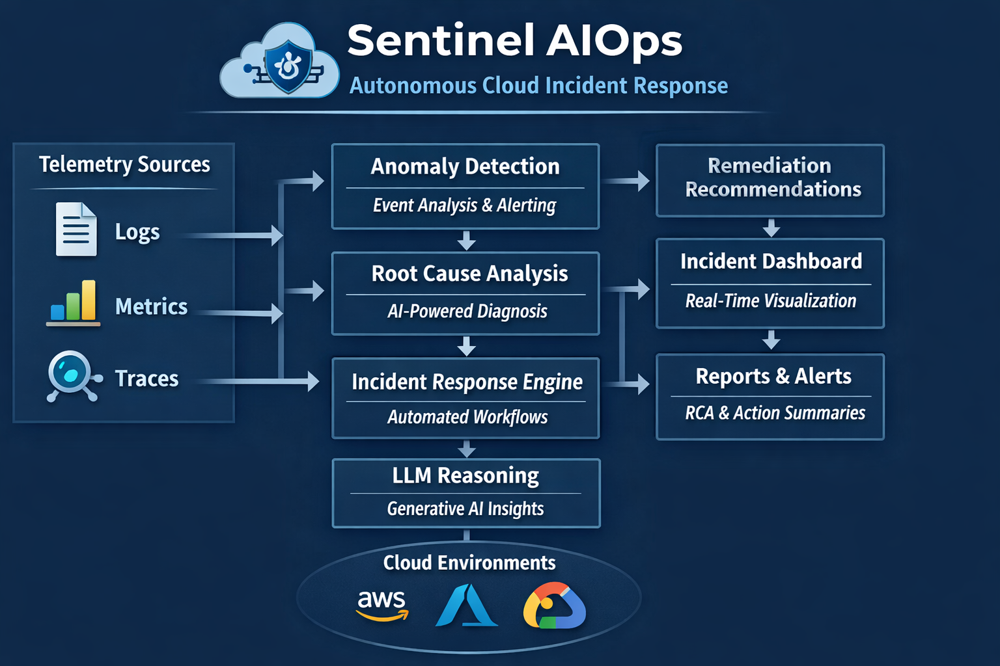

# Sentinel AIOps - Autonomous Cloud Incident Response

## Overview

This project is a **platform-level Autonomous Cloud Incident Response and AIOps system** designed for **Site Reliability Engineering (SRE) and DevOps teams**.

It continuously observes telemetry, detects actionable incidents, performs **AI-assisted root cause analysis with deterministic safeguards**, recommends remediation actions, generates structured post-incident reports, and visualizes operational insights through a dashboard.

This is **not** a chatbot, RAG demo, or toy automation.\
It is a **responsible, safety-first autonomous SRE system** that mirrors real enterprise incident response workflows while remaining **100% Minimal-cost**.

---

## Design Philosophy

**Reliability, correctness, and safety come before automation.**

The platform follows real enterprise SRE principles:

- No blind auto-remediation
- Deterministic decision gates
- Human-in-the-loop execution
- AI used for reasoning and explanation, not authority

Autonomy is applied **responsibly**, not recklessly.

---

## Problem Statement

In real enterprise environments:

- Hundreds of alerts are generated daily
- Engineers manually correlate metrics and logs
- Root cause analysis (RCA) is slow and error-prone
- Incident reports are written manually after resolution
- Mean Time To Resolve (MTTR) is high

Even with mature monitoring tools, teams suffer from **alert fatigue, delayed response, and poor post-incident visibility**.

---

## Solution Summary

This platform introduces an **autonomous, AI-assisted incident analysis workflow** that:

- Filters telemetry noise and detects only actionable incidents
- Correlates metrics and logs deterministically
- Uses GenAI for **constrained root cause reasoning**
- Applies **rule-based remediation guardrails**
- Auto-generates structured post-incident documentation
- Preserves safety with deterministic fallbacks and approval gates

---

## Cloud-Agnostic by Design

The system is **cloud-agnostic at the architectural level**.

Although the design maps naturally to AWS, Azure, and GCP observability stacks, the implementation itself is provider-independent and can run in:

- AWS
- Microsoft Azure
- Google Cloud Platform (GCP)
- On-premises environments
- Hybrid and multi-cloud setups

### Telemetry Abstraction

All telemetry is normalized into a **common incident schema**.\
In production, this would be handled via adapters such as:

- CloudWatch Adapter
- Azure Monitor Adapter
- On-Prem Agent Adapter

The current implementation uses **JSON-based telemetry adapters** to simulate this behavior without cloud cost or vendor lock-in.

---

## What Makes This Platform Autonomous

The system is autonomous across four dimensions:

1. **Observation**\
   Continuously evaluates metrics and logs

2. **Decision-Making**\
   Determines whether an incident exists based on severity and confidence

3. **Analysis**\
   Performs root cause reasoning using AI with deterministic fallbacks

4. **Response Planning**\
   Generates remediation recommendations and structured reports

 **Execution remains human-approved**, aligning with real enterprise safety practices.

---

## High-Level Architecture

<p align="center">  </p>

---

## Core Components

### 1. Telemetry Design

- Metrics grouped by domain (compute, traffic, latency, errors)
- Each metric includes:
  - value
  - severity
- **Severity is the single source of truth**

---

### 2. Incident Detection Engine

- Recursively scans telemetry
- Triggers incidents **only** for HIGH / CRITICAL severity
- LOW / MEDIUM telemetry is filtered to reduce noise
- Produces structured incident metadata

---

### 3. Incident Confidence Model

To avoid false positives, incidents are evaluated using a **confidence score** derived from:

- Number of affected metrics
- Severity distribution
- Temporal correlation window

An incident is confirmed only when confidence crosses a defined threshold.

---

### 4. Workflow Orchestration (LangGraph)

- Multi-step incident analysis workflow
- Deterministic execution order
- Workflow is skipped entirely if no incident is detected

LangGraph is used as a **free alternative to managed workflow engines**, not as an LLM playground.

---

### 5. Root Cause Analysis (AI-Assisted)

**Inputs**

- Aggregated metric anomalies
- Log error frequency deltas
- Incident symptoms

**AI Role**

- Generate concise RCA explanations
- Reference observed signals only

**Safety Guarantees**

- AI output is validated
- Deterministic fallback used if AI fails or produces inconsistent results

---

### 6. Recommendation Engine

- Remediation actions are defined by **deterministic rules**
- AI generates explanations, not actions
- Allowed actions are strictly constrained
- Confidence adjusted based on severity

---

### 7. Incident Report Generation

Automatically generates structured post-incident reports in:

- Markdown
- PDF

Each report includes:

- Incident summary
- Timeline
- Root cause
- Recommended actions
- Preventive measures

---

### 8. Operational Dashboard

A Streamlit-based **SRE-facing operational dashboard** providing:

- Latest incident overview
- Incident history table
- Filters by severity, date, and incident ID
- Severity distribution charts
- Secure report downloads
- Defensive UI handling

---

## Technology Stack

### Core

- Python 3.10+
- LangGraph – workflow orchestration
- Streamlit – dashboard UI
- Altair – visualizations

### GenAI

- OpenRouter (Meta LLaMA models – free tier)
- Deterministic fallbacks for all AI components

### Reporting

- Markdown
- ReportLab (PDF generation)

### Data & Analytics

- JSON (telemetry & persistence)
- Pandas

---

## Project Structure

```
cloud_incident_response/
├── analysis/
├── detection/
├── reasoning/
├── recommendations/
├── reporting/
├── workflows/
├── dashboard/
├── data/
│   └── metrics/
├── reports/
├── tools/
└── README.md
```

---

## Reliability & Safety Guarantees

- No incidents triggered for LOW / MEDIUM telemetry
- Confidence-based incident confirmation
- Deterministic fallbacks for all AI components
- No hallucinated remediation actions
- Human-in-the-loop execution model
- Graceful handling of AI or data failures

---

## How to Run

### Setup Environment

```bash
python -m venv venv
source venv/bin/activate    # Windows: venv\\Scripts\\activate
pip install -r requirements.txt
```

### Configure API Key

Create a `.env` file:

```env
OPENROUTER_API_KEY=your_key_here
```

### Run Incident Workflow

```bash
python -m workflows.run_workflow
```

### Launch Dashboard

```bash
streamlit run dashboard/app.py
```

### Generate Multiple Incidents (Optional)

```bash
python tools/telemetry_simulator.py
```

---

## Use Cases

- SRE incident response automation
- AIOps and observability platforms
- GenAI + infrastructure demonstrations

---

## Future Enhancements

- Incident deduplication window
- Incident lifecycle (OPEN → RESOLVED)
- MTTR calculation
- Streaming telemetry ingestion
- Controlled external knowledge (CVE feeds, outage advisories)
- Auto-remediation with approval gates

---

## Why This Project Matters

- Demonstrates **platform-level thinking**
- Applies GenAI to **real operational problems**
- Avoids chatbot and RAG anti-patterns
- Shows SRE-aligned autonomy and safety
- Maps directly to real enterprise architectures

---

## Author

**Arun**\
Autonomous Cloud Incident Response & AIOps Platform

